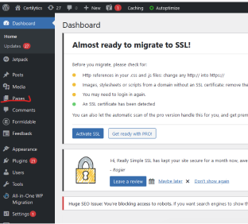
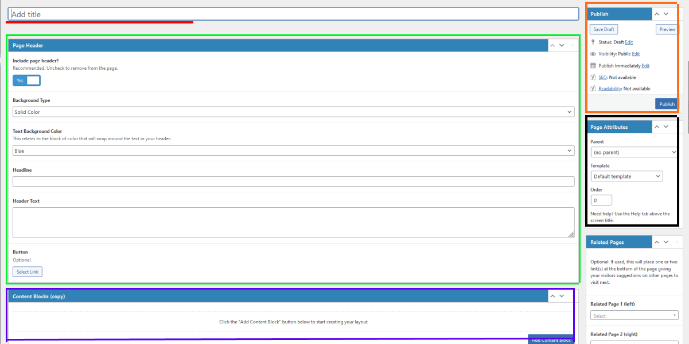
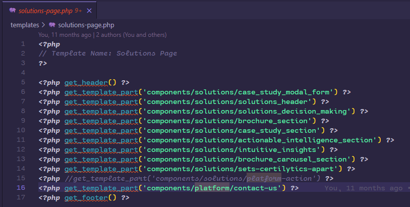
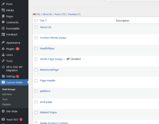
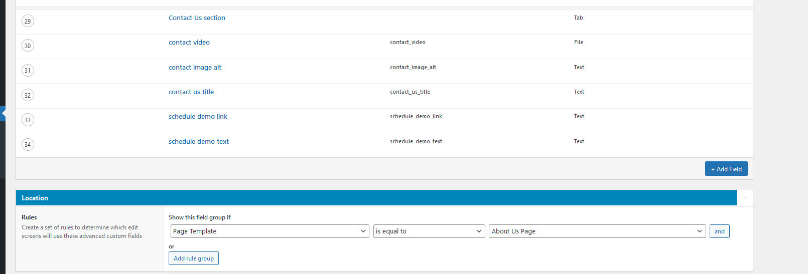
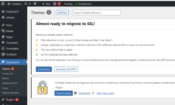
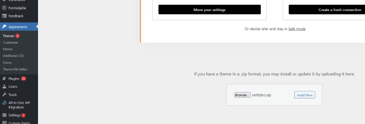
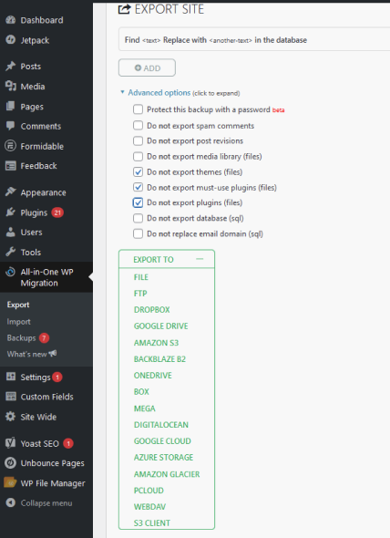

# Development Process

This guide it's designed to take anyone through the development process for the certilytics wordpress theme.

## Content
- [Creating new pages](#creatingNewPages)
    - [Creating a new template](#creatingANewTemplate)
- [adding custom fields to pages](#customFieldsToPages)
- [PR & Branch Creation](#prCreation)
- [Bundle Creation & Deployment](#bundleCreation)
- [Environment Sync](#envSync)

<a name="creatingNewPages"></a>
## Creating New Pages

To create a new page, first, we need to go to the backend side of WordPress which can be accessed by adding `/wp-admin after any of the environment URLs. 

**Example:**
```
http://localhost:3000/web3.0/wp-admin
```

Once you are logged In to the backend, head to pages



Once on the "pages" page, click on add new on top of the page and that will show the create new page.



**Add Title (RED):** This field is used to give an identifier to the new page and a title.

**Page Header (GREEN):** This section is used to configure some metadata used within WordPress for SEO.

**Content Block (PURPLE):** This section represents the content of the new page and this is related and changed by the combination of the selected template file `(BLACK section)` and the custom fields group.

**Page Attributes (BLACK):** This section is used to specify if the page is a child page related to a selectable parent page, this will be reflected on the main Menu as a child element of the selected parent page.

The template dropdown is used to specify the template that the page will be used to display the content by accessing the content that it's defined on this page, also the fields are specified using a plugin called Advanced Custom Fields.

**Publish (ORANGE):** This section is used to publish the new page or save updates to an existing page.

<a name="creatingANewTemplate"></a>
## Creating a Template File
This happens on the source code of the theme under the `./templates` directory.

All files under the templates directory will be recognized by WordPress and be available for selection on the `add page` or `edit page` pages.



To have the template file available within WordPress the first code block with a comment it's obligatory and the name specified it's the displayed name within WordPress. 
```php
<?php 
  // Template Name: Example Name
?>
```

<a name="customFieldsToPages"></a>
## Adding Custom Fields to Pages

Advanced Custom Fields is used to add custom fields to page content.



To access the fields group edit page, create a new field group or select edit on an existing field group.

The edit page has the content representation of a page or set of pages.



The most important note to take into consideration is the `Location` section since this is used to specify which page or pages are going to use this custom field group. Once the custom fields are created, the location is set and then saved. To get those fields on a page, the page template selected in the page should match the location logic in the edit custom field page.

<a name="prCreation"></a>
## PR & Branch Creation

To create a pull request follow these guidelines:

- If there's a user story related to the work to be done include it in the branch name.

- Depending on the type of user story if it's a feature use `feature` if it's a bug use `fix` as the starting branch name

**Example:**
```
//[fix || feature]/[user story id]-[short-description]
$ git checkout -b feature/89343-add-banner-to-site-header
```

For `Pull Requests` add a short description of the work done in the commit message.

To `merge` the pull request `squash` the commits and after merging, delete the pull request branch to keep the repo clean.

<a name="bundleCreation"></a>
## Bundle Creation & Deployment

To generate the theme artifact that's used in WordPress, make sure to have the latest version of the theme by pulling from the repo. Once the selected branch is up to date, use the next command:
```zsh
$ npm run bundle
```

Once the bundling process finishes the output directory is `./packaged` and there lives the `certilytics.zip` theme file.

To deploy the new theme file, first, go to the admin page `yourdomainexample.com/wp-admin`.

Select the `Appearance` option and then add new on top of the page.



On the next page select `upload theme` on top of the page, then browse the `certilytics.zip` file and upload it.
click on `Install Now`.



Lastly, click on the `Replace Activa With Uploaded`.

Congratulations. Theme deployed and updated!🥳

⚠️**IMPORTANT: don't use the All In One WP Migration plugin (covered in the next section) to deploy since it will overwrite the entire content, including posts and pages. This will break the environment.** 

<a name="envSync"></a>
## Environment Sync

For Environment Syncs **All-in-one WP Migration** plugin is used.
;

Go to export within All-in-ONe Wp Migration and be sure to select the selected advanced options as shown above ⚠️**If this is not done it will break the environments that are being updated**.  
Click on the `file` option and wait for the download to complete.

Once the export is done go to the target environment use the import tool from All-In-One WP Migration plugin and upload the generated file from the original environment.

Unfortunately, it's not as simple as plug and play and there's also some manual work involved to have a full sync.

- Custom field updates will need to be created or updated manually
- Some Media files need to be saved manually in the new environment
- Run content testing to ensure it's working as expected when introducing new content to the environment. If not update manually.


⚠️**Use this plugin to sync the dev environments and use prod as the source of truth and not the other way around since it will break the environment.**

⚠️**In general it's better to update manually all content by updating envrionemnts by deploying cycles since it can reduce errors.**

